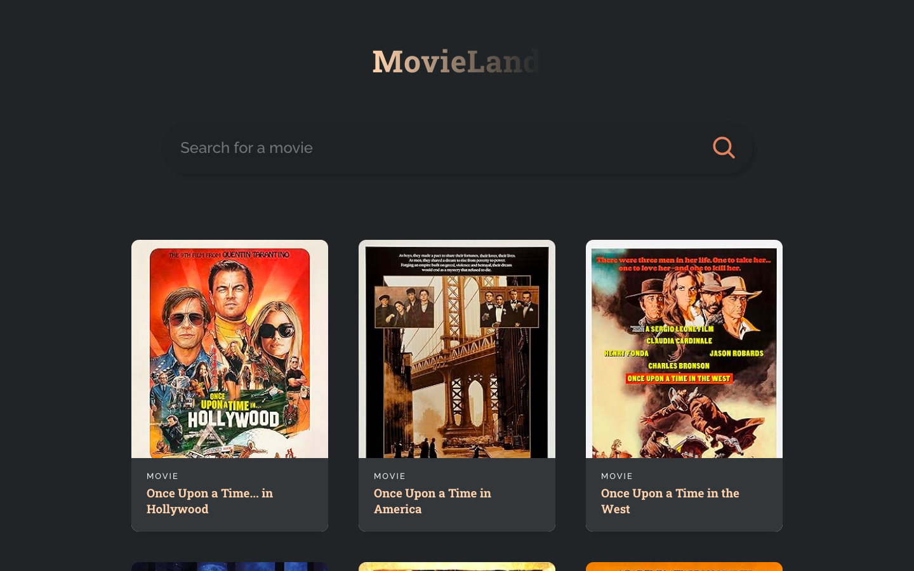

# 🎥 MovieLand

MovieLand is a sleek and interactive web app that allows users to search and explore movies and TV shows. By leveraging the OMDB API, MovieLand fetches comprehensive details for any title and displays them beautifully using React and Tailwind CSS.

<br/>

## ⏰ Features

- **Movie Search**: Enter a title in the search bar, and MovieLand fetches relevant movies and TV shows in real time.
- **Movie Cards**: Displays essential information such as posters, titles, and categories for each movie or TV show.
- **Interactive UI**: Tailored design and responsiveness powered by Tailwind CSS.
- **Real-Time Fetching**: Utilizes Fetch API to seamlessly integrate data from OMDB.

<br/>

## 📸 Screenshots

### Landing Page
<br/>
<p align="center">
   
</p>

<br/>

## 🛠️ Tech Stack

- **Frontend**: React, Tailwind CSS
- **Backend**: Fetch API (for OMDB integration)
- **Data Source**: [OMDB API](http://www.omdbapi.com/)
- **Hosting**: Vercel

<br/>

## 🔄 How It Works

1. Open the MovieLand app and navigate to the search bar.
2. Enter any movie or TV show title and press the search icon.
3. View results as beautifully designed cards, showing movie posters, titles, and types.


<br/>

## 🛋️ Installation

### Prerequisites
- Node.js and npm installed on your system
- An OMDB API key (get one [here](http://www.omdbapi.com/apikey.aspx))

### Steps
1. Clone the repository:
   ```bash
   git clone https://github.com/yourusername/movieland.git
   ```
2. Navigate to the project directory:
   ```bash
   cd movieland
   ```
3. Install dependencies:
   ```bash
   npm install
   ```
4. Create a `.env` file in the root directory and add your OMDB API key:
   ```env
   REACT_APP_OMDB_API_KEY=your_api_key
   ```
5. Start the development server:
   ```bash
   npm start
   ```
6. Open your browser and navigate to:
   ```
   http://localhost:3000
   ```

<br/>

## 📞 Support

For any issues or questions, feel free to reach out at: [akashabraham46@gmail.com](mailto:akashabraham46@gmail.com)

<br/>

## ✨ Show Your Support

If you like this project, please consider giving it a ⭐ on [GitHub](https://github.com/yourusername/movieland)!

<br/>

## 📚 License

This project is licensed under the MIT License. See the [LICENSE](LICENSE) file for details.

